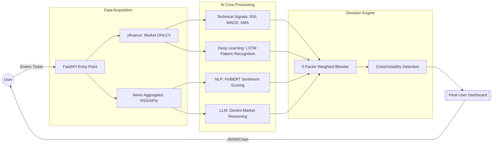

# StockSense AI — System Flow

This flowchart describes how a single prediction request is processed through the system.

### Flow Components:
1. **User Request**: Initiated when a ticker (e.g., `RELIANCE.NS`) is searched.
2. **Data Acquisition**: Simultaneously fetches 2 years of price history and current news.
3. **AI Logic**:
   - **LSTM**: Predicts price movement based on historical "waves."
   - **Technical Signals**: Checks momentum and volume.
   - **FinBERT**: Measures if the news is "Bullish" or "Bearish."
   - **Gemini**: Provides a human-like explanation of why the score is what it is.
4. **Blender**: Adjusts weights dynamically (e.g., news counts more if volatility is high).
5. **Dashboard**: Returns the 5-day forecast, confidence level, and risk assessment.
